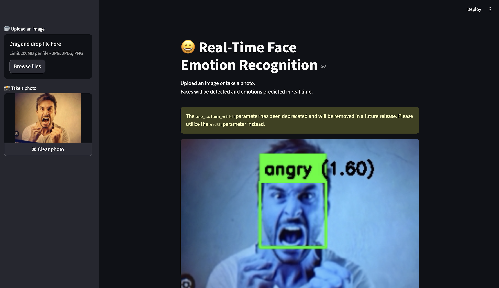

  #  Face Emotion Recognition (ResNet18 + CBAM)

A real-time Face Emotion Recognition system built using **PyTorch**, **ResNet18 + CBAM**, **MediaPipe**, and **Streamlit**.

This project detects faces using MediaPipe and predicts emotions in real-time and also image through a clean Streamlit interface.


<p align="center">

</p>


## Tech Stack
* python
* torch
* torchvision
* opencv
* mediapipe
* ResNet18
* CBAM
* numpy
* matplotlib
* Pillow
* streamlit


##  Features

-  Face Detection using MediaPipe
-  ResNet18 with CBAM Attention
-  Real-time Emotion Prediction
-  Streamlit Web UI
-  Modular Code Structure
-  Optimized Face Cropping
-  Webcam Mirroring Support

---

##  Emotion Classes

- Angry
- Disgust
- Fear
- Happy
- Sad
- Surprise
- Neutral

---

##  Project Structure
```
Face-Emotion-Recoginition/
│
├── src/
│ ├── app.py # Streamlit UI
│ ├── realtime_infer.py # Real-time webcam inference logic
│ ├── train.py # Model training script
│ ├── utils.py # Helper functions 
```
---

## Model Architecture

- Backbone: ResNet18
- Attention: CBAM (Convolutional Block Attention Module)
- Input Shape: `1 x 3 x 224 x 224` (training input was 48x48 however we upscale the image size into 224 because pretrained resnet18 is expect this )
- Output: 7 emotion classes
- Loss: CrossEntropyLoss
- Optimizer: Adam

CBAM improves performance by helping the model focus on important facial regions such as eyes and mouth.

---

##  Installation

```bash
git clone https://github.com/NG11-git/Face-Emotion-Recoginition.git
cd Face-Emotion-Recoginition

pip install -r requirements.txt
```
## Run Streamlit App
```
streamlit run src/app.py
```

## Real-Time Inference (Without Streamlit)
```
python src/realtime_infer.py
```
## Train the Model
```
python src/train.py
```
Recommended:

Image Size: 64x64

Grayscale input

Data augmentation (HorizontalFlip, Rotation)

--
## Model Performance

Achieved ~73% training accuracy

### Performance depends on:

Dataset balance

Lighting conditions

Face crop quality

--

## Known Improvements Implemented

Fixed BGR → RGB conversion

Improved face crop quality

Webcam horizontal flip

Softmax confidence handling

Better preprocessing pipeline

#### Author
Nandhu Gopan
